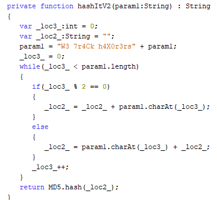
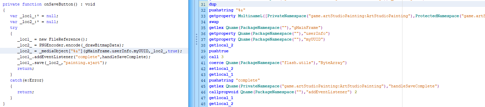
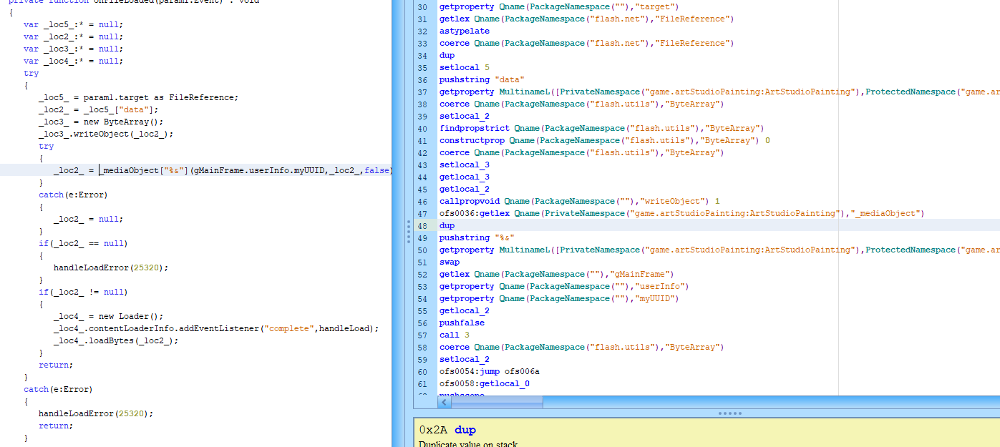
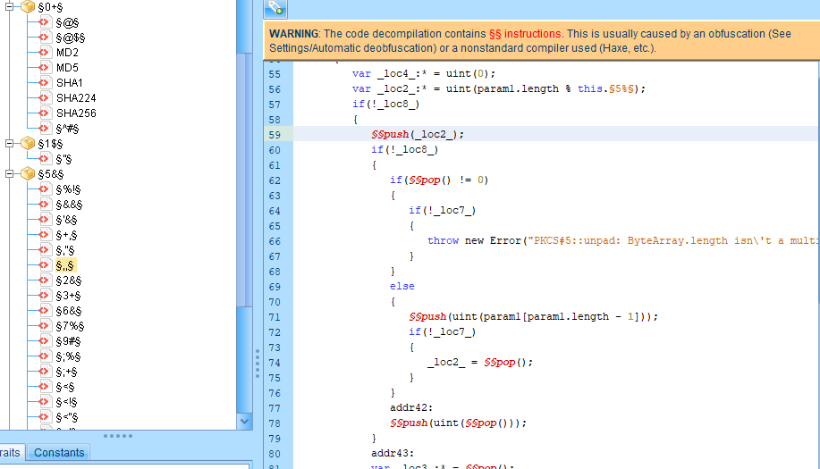
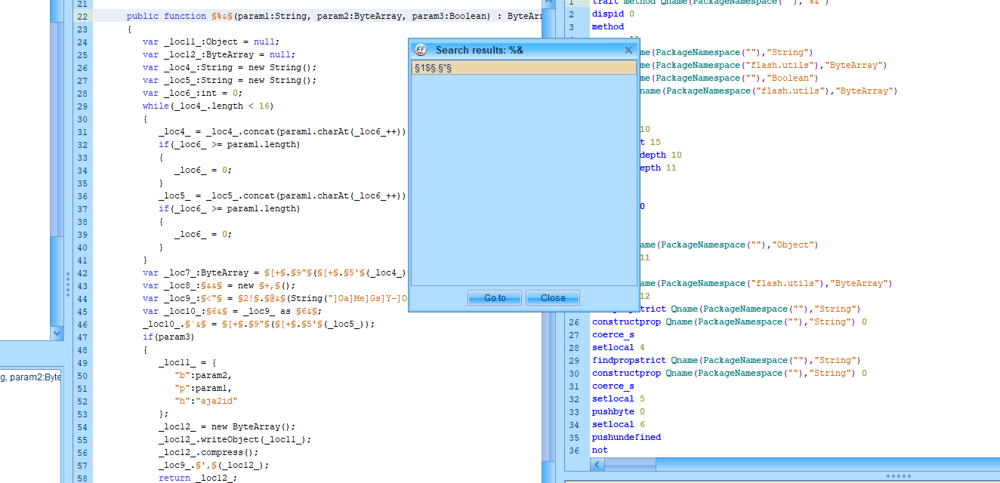

# Research:
The reverse engineering is going to sound easy now that all of the information has been found, but this entire process took at least 100 hours of time using multiple different tools and many trials. If you're going to be a reverse engineer though you have to be persistent.

##### Tools:
1. JPEXS Flash Decompiler
2. HxD (Hex Editor)
3. Telerik Fiddler 4
4. Curl
5. Wireshark
6. An IDE of Choice

#### Humble Beginnings:
So how do we start a project like this? Well we have our goal, and that goal is being able to extract images from .ajart files, but also be able to create our own. The first thing I did was a little research, and through this surface level scraping I found that the .ajart file format was updated when someone previously figured out it was basically just compressed data, and ever since nobody was able to work around the new format (updating it also made every existing .ajart file invalid for loading into the studio).

Interesting, next I observed that when saving a .ajart file from one account, it was unable to be loaded using different accounts -- and this immediately told me that the file must somehow be tied to the user, and likely through either the username or a unique user ID. Looking at a .ajart file using a hex editor like HxD basically returned pure gibberish, making it obviuous that the file was encrypted and reinforcing the idea that the files were somehow linked with the user.

At this point all we really know is that a .ajart file is encrypted, and either the username or UUID play a role in the process.

#### File Scraping:
Animal Jam itself runs through Flash, so that made it clear I would be dealing with .swf files. At this point I was using Charles Web Debugging Proxy and monitored my connection while logging in to Animal Jam, which returned no real results. So I downloaded an extension that allowed me to download .swf files it could find on a given page, which included the main Animal Jam project. Using the JPEXS Decompiler I was able to scrape my way through the code, and this was a **long** process looking for information relevant to the task at hand (especially since it became apparent early on obfuscation from secureSWF was used). I spent (wasted) a lot of time treading through base libraries implementing things like the Media class and gMainFrame (the main window). I looked through every file I could readily find and download however, which led to this funny little easter egg in the preloader that genuinely made me laugh but also put into perspective the challenge, and while I wasn't "hacking" I was basically going through the same process a hacker would:


At this point I felt like I had everything I needed, right?... (yeah no)

#### Further Observations:
Obviously the most important file from the main program was "ArtStudioPainting" which contained most of the information about how everything was working. Most of the information here was about how different tools in the art editor worked and other boring implementation details, but the important areas had to do with Loading and Saving the images, which were plain as day -- I spent so many hours digging through code trying to find the implementation to these methods and came up with nothing no matter how much I cross referenced. While the code was obfuscated JPEXS has excellent deobfuscation features making this a little less painful.



From the saving and loading the line that popped out in particular was certainly:
```
_loc2_ = _mediaObject["%&"](gMainFrame.userInfo.myUUID,_loc2_,true);
```
My first thoughts are "well I have no clue what the %& is doing, but this has to be the decryption because it's taking in the uuid, image byte data, and a bool that must mean it's either saving or loading". The fact that _mediaObject is defined as private var _mediaObject:MovieClip; sent me on the wild goose chase I described earlier where I'm hunting for implementation details.

#### Many Hours Later...
After awhile it became clear I was missing something, and I turned my attention back to the ["%&"], I still had no clue what it was doing until I read the straight decompiled code to the right in JPEXS, which is the ActionScript Virtual Machine language. I read into the AVM2 Overview pdf provided by Adobe and realized it was making a call to a function called "%&" (clearly obfuscated). This is the real kicker though, there is no %& function defined in this main file with **ALL OF THE OTHER CODE.**

As it turns out, the MultinameL property (Multiple Namespace Name **Late**) had special significance I overlooked and kicked myself for, and according to the AVM2 Overview:

**2.3.5 MultinameL (Multiple Namespace Name Late):**
*This is a runtime multiname where the name is resolved at runtime. The namespace set is used to represent a collection of namespaces. MultinameL entries have a namespace set index. The namespace set index is an index into the namespace set constant pool. When a MultinameL is an operand to an opcode there will be a name value on the stack. The name value on the stack must be of type String. MultinameLs are typically used for unqualified names where the name is not known at compile time.*

Oh... the library I need is dynamically loaded... **DSAHJADKJSHDSHAJKAFFAJDKFLS**

#### Getting the Right Library
Knowing now that the code library I needed was dynamically loaded I attempted to sniff it out, first using Charles Web Debugging Proxy -- but that was getting me nowhere and I needed a tool that would monitor every single request between my computer and the outside world. This is where I came across the Telerik Fiddler 4 Web Debugger, which was adequate for the given situation.

I started Fiddler 4 and went into the Art Studio room in-game, and after looking through the requests/responses found that Animal Jam was connecting to an odd and very particular link consistently. Now I have the right URL.

The right tool for the job to directly pull that data intact was cURL, "a command line tool and library for transferring data with URLs". I saved the information from that link to a file called t4.swf, and opened that with JPEXS.

#### Holy Obfuscation


Huh... well, okay then. Luckily JPEXS has a great deobfuscator and was able to clean **that** up, at least close to where the main Animal Jam executable was in terms of readability.

Is there a %& function here?... Oh yes.


#### The Method At Last
The rest is basically explained by the [File Format.md](https://github.com/cfr0st/aj-art-edit/blob/master/File%20Format.md). From this code and after some simple manual deobfuscation and cross referencing / code following it became clear they were using aes to encrypt the files, but before that calculating the key and initialization vector with the UUID, then compressing an AMF object comprising of the UUID, image data, and a hard coded string "aja2id" before finally encrypting and returning that byte data.

The method of encrypting this data is sound enough (although obviously not completely secure), but the fact that it is done in the first place brings questions to mind. By tying an image to a UUID and not a password a user could set, not only can the art *only* be loaded on the artist's account, but if the account is lost then that artwork is essentially gone forever. Not only this but many individuals in that game's community who are learning to make art using advanced tools (like FireAlpaca, Adobe Photoshop, Affinity Photo, Paint.Net, etc) can't bring their art into the game or recreate it because the tools in the Art Studio are so simple.

#### But Not Quite Finished Yet
So now I have all of the implementation details, but I'm missing a *key* component (haha). So I used a tool called Wireshark to sniff all of my traffic down to the packet level, and searched through the frames for my username -- and as it turns out to lessen the workload on Animal Jam servers information like the UUID is shared surprisingly. Enough of scraping through those references led me to finding the information I needed, which was the UID, but also a lot of extra stuff that ended up being mostly useless in this case.

#### The End...
With all of that knowledge gathered I used my favorite IDE and language to make a program which could take the information learned and produce results, in both the directions of decrypting and creating .ajart files. A code implementation of this is located in the src section of this repository. Recently I decided to add support for the .ajgart (pixel art format) as well.
